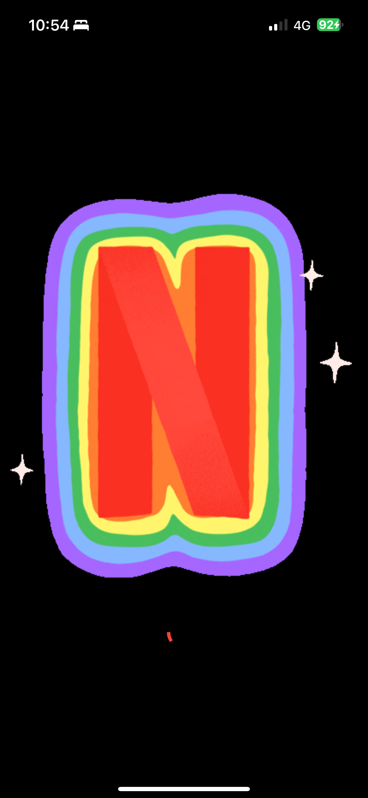
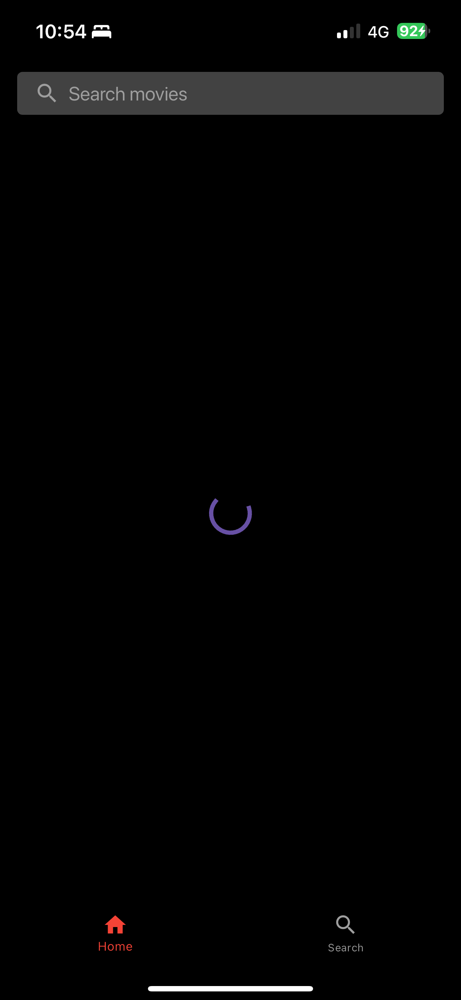
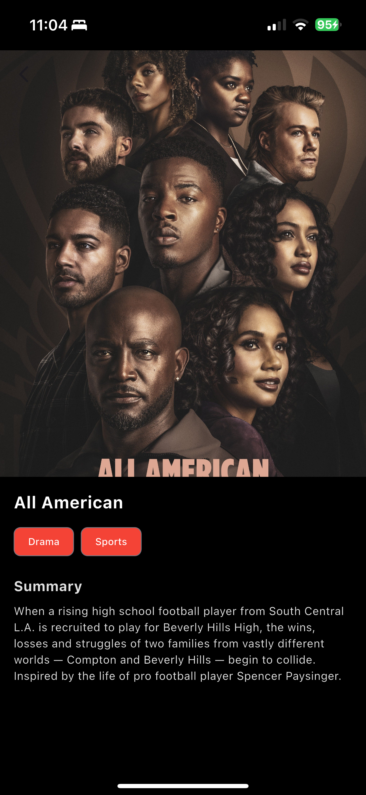
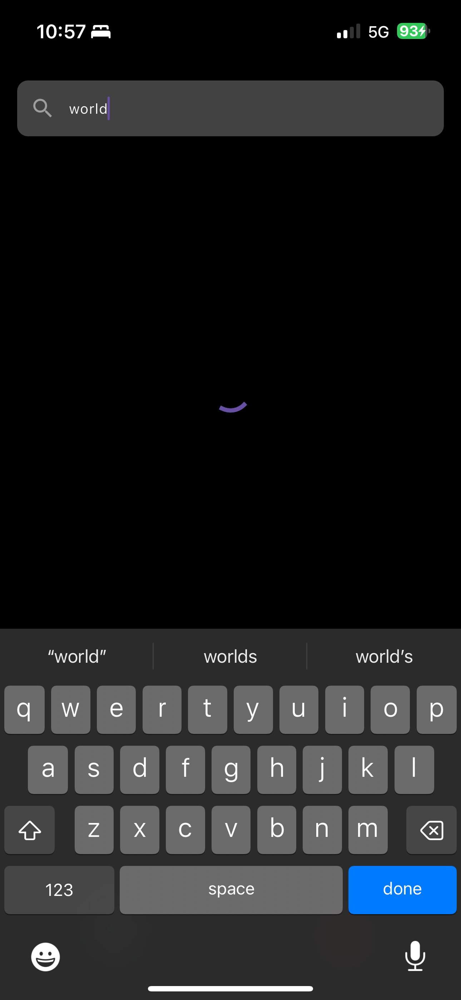
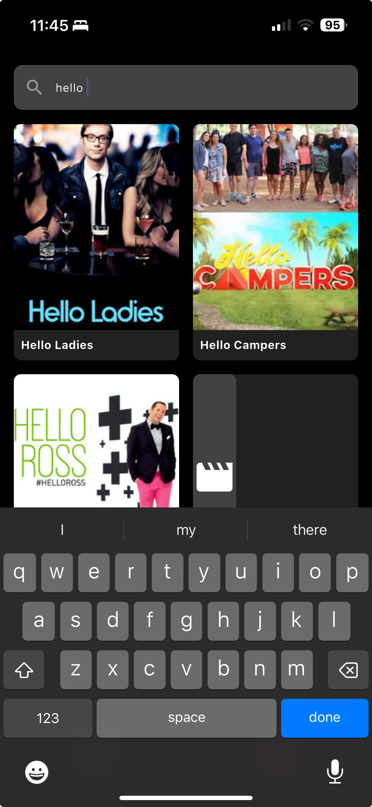
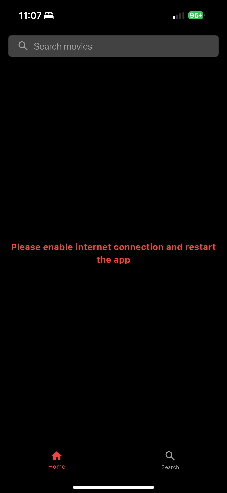

# Netflix Clone - Flutter & Riverpod

A modern Netflix-style movie browsing application built with Flutter and Riverpod state management. This app demonstrates clean architecture principles, proper state management, and best practices for Flutter development.

---

### Download APK / View on web

<a href="https://github.com/chetanr25/netflix-clone-flutter/raw/refs/heads/main/assets/apk/app-release.apk">

</a>

<a href="https://netflix-clone-flutter.vercel.app">

</a>

---


## Screenshots

<table align="center">
  <tr>
    <td align="center"><br/>Splash Screen</td>
    <td align="center"><br/>Home Loading Screen</td>
    <td align="center"><br/>Home Screen</td>
    <td align="center"><br/>Details Screen</td>
  </tr>
  <tr>
    <td align="center"><br/>Search Loading Screen</td>
    <td align="center"><br/>Search Screen</td>
    <td align="center"><br/>Search screen results</td>
    <td align="center"><br/>Error handling</td>
  </tr>
</table>

---

## Demo Video 
https://github.com/user-attachments/assets/7c0ffe77-8c44-4a09-8010-b1a63edf435c

---

## Features

- 🎬 Browse movies from TVMaze API
- 🔍 Real-time search functionality
- 💫 Smooth animations and transitions
- 🌙 Netflix-inspired dark theme
- 📱 Responsive design
- 🏗️ Clean architecture
- 🔄 State management with Riverpod
- ⚡ Fast and efficient

## Architecture

The project follows a clean architecture pattern with the following structure:

```
lib/
├── models/          # Data models
├── providers/       # Riverpod providers
├── screens/         # UI screens
├── services/        # API and business logic
├── widgets/         # Reusable UI components
└── main.dart        # App entry point
```

### Key Components

1. **Models**

   - `Movie`: Data class representing movie information
   - Handles JSON serialization/deserialization

2. **Providers**

   - `apiServiceProvider`: Provides API service instance
   - `moviesProvider`: Manages movie list state
   - `searchQueryProvider`: Manages search query state
   - `searchResultsProvider`: Manages search results state

3. **Screens**

   - `SplashScreen`: Initial loading screen
   - `MainScreen`: Bottom navigation handler
   - `HomeScreen`: Movie grid display
   - `SearchScreen`: Movie search interface
   - `DetailsScreen`: Movie details view

4. **Services**
   - `ApiService`: Handles API communication with TVMaze
5. **Widgets**
   - `MovieCard`: Reusable movie display card
   - `MovieGrid`: Grid layout for movies
   - `SearchBar`: Custom search input widget

## Setup & Installation

1. **Prerequisites**

   ```bash
   flutter --version  # Ensure Flutter is installed
   ```

2. **Dependencies**
   Add the following to your `pubspec.yaml`:

   ```yaml
   dependencies:
     flutter:
       sdk: flutter
     flutter_riverpod: ^2.4.0
     http: ^1.1.0
   ```

3. **Installation**

   ```bash
   flutter pub get
   ```

4. **Run the app**
   ```bash
   flutter run
   ```

## Performance Considerations

- Lazy loading of images
- Image caching for faster loading and internet data savings
- SplashScreen for initial loading
- Efficient state management with Riverpod
- Minimal rebuilds using Consumer widgets
- Proper use of const constructors
